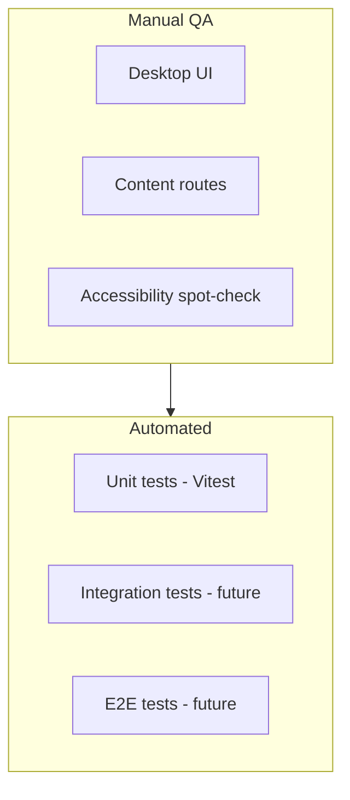

# Dummy Test Plan — maxleiter.com

This is a **dummy / sample** test plan for the personal portfolio site in this repo. Automated coverage starts with Vitest unit tests for the terminal command layer; manual cases below cover the rest of the site.

## Scope

| In scope | Out of scope |
|----------|--------------|
| Desktop homepage and terminal | Third-party uptime (GitHub API, knightos.org) |
| Subpage routes (blog, projects, books, etc.) | Vercel deployment config |
| MDX content loading and rendering | Supabase analytics backend |
| RSS/sitemap/redirects | KnightOS embedded emulator internals |
| Theme toggle and mobile behavior | Performance benchmarking (optional future phase) |

## Test environment

- **Local:** `pnpm dev` at `http://localhost:3000`
- **Production-like:** `pnpm build && pnpm start`
- **Automated:** `pnpm test` (Vitest)
- **Browser matrix (dummy):** Chrome latest, Safari latest, mobile Safari (iOS), Chrome Android
- **Mock data:** [`public/mock-stars-response.json`](../public/mock-stars-response.json), [`public/mock-commit-response.json`](../public/mock-commit-response.json) for dev GitHub responses

## Test categories



---

## 1. Desktop UI (homepage)

**Entry:** [`app/(subpages)/page.tsx`](../app/(subpages)/page.tsx), [`app/components/desktop/desktop-client.tsx`](../app/components/desktop/desktop-client.tsx)

| ID | Test case | Steps | Expected |
|----|-----------|-------|----------|
| D-01 | Page loads | Open `/` | Desktop metaphor renders; no console errors |
| D-02 | Open window | Click a widget or icon | Window opens with title bar and content |
| D-03 | Close window | Close button on window | Window removed; state consistent |
| D-04 | Multiple windows | Open 2+ windows | Z-order and focus behave correctly |
| D-05 | Command palette | Open palette (keyboard shortcut) | Search/navigation works |
| D-06 | Calculator widget | Open calculator, perform `2+2=` | Displays `4` |
| D-07 | CRT / juice effects | Toggle via terminal or UI | Visual effects on/off without crash |
| D-08 | Mobile redirect | Resize to mobile width, open blog post | Redirects to `/blog/[slug]` per [`use-is-mobile.ts`](../app/components/desktop/use-is-mobile.ts) |

---

## 2. Terminal emulator

**Entry:** [`app/components/desktop/terminal/commands.ts`](../app/components/desktop/terminal/commands.ts)

| ID | Command | Input | Expected |
|----|---------|-------|----------|
| T-01 | help | `help` | Lists available commands |
| T-02 | ls | `ls` | Lists virtual directory entries |
| T-03 | pwd | `pwd` | Prints current path |
| T-04 | cat | `cat readme` | Prints file content or error |
| T-05 | echo | `echo hello` | Prints `hello` |
| T-06 | clear | `clear` | Clears terminal output |
| T-07 | exit | `exit` | Closes terminal window |
| T-08 | unknown | `foobar` | Friendly error message |
| T-09 | crt / juice | `crt on`, `juice off` | Effects toggle (ties to D-07) |

**Automated (Vitest):** `tokenize`, `parseArgs`, `findCommand`, `getCommandNames`, `getCompletions`, and command handlers — see [`commands.test.ts`](../app/components/desktop/terminal/commands.test.ts).

---

## 3. Content routes

| ID | Route | Expected |
|----|-------|----------|
| R-01 | `/blog` | Post list renders; links valid |
| R-02 | `/blog/[slug]` | MDX body renders; metadata/OG present |
| R-03 | `/projects` | Project cards; star counts (mock in dev) |
| R-04 | `/books` | Book list; genre filter works |
| R-05 | `/books/[slug]` | Book detail page loads |
| R-06 | `/talks` | Talks list renders |
| R-07 | `/labs` | Labs index loads |
| R-08 | `/about` | About page content |
| R-09 | 404 | Visit `/nonexistent` | Custom or default 404 |

**Data layer (future integration tests):** [`app/lib/get-posts.ts`](../app/lib/get-posts.ts), [`get-books.ts`](../app/lib/get-books.ts), [`portfolio-data.ts`](../app/lib/portfolio-data.ts) — sorting, unpublished filtering, slug resolution.

---

## 4. MDX and components

| ID | Test case | Expected |
|----|-----------|----------|
| M-01 | Post with images | Images load via [`mdx-image`](../app/mdx/components/mdx-image.tsx) |
| M-02 | Post with diff block | [`mdx-diff`](../app/mdx/components/mdx-diff.tsx) renders |
| M-03 | Post with note callout | [`mdx-note`](../app/mdx/components/mdx-note.tsx) renders |
| M-04 | Tweet embed | [`tweet-thread`](../app/mdx/components/tweet-thread.tsx) loads or graceful fallback |

---

## 5. SEO, feeds, redirects

| ID | Test case | Expected |
|----|-----------|----------|
| S-01 | `/feed.xml` | Valid RSS (from [`scripts/rss.ts`](../scripts/rss.ts)) |
| S-02 | `/atom`, `/feed`, `/rss` | Redirect to `/feed.xml` ([`next.config.mjs`](../next.config.mjs)) |
| S-03 | `/X11` | Redirects to `/blog/X11` |
| S-04 | `/sitemap.xml` | Contains blog, books, main routes ([`app/sitemap.ts`](../app/sitemap.ts)) |
| S-05 | OG image | `/opengraph-image` and blog slug OG routes return images |

**Build check:** `pnpm build-rss && pnpm build` completes without fatal errors.

---

## 6. API routes

| ID | Test case | Expected |
|----|-----------|----------|
| A-01 | KnightOS proxy valid path | [`app/api/knightos-package/[...path]/route.ts`](../app/api/knightos-package/[...path]/route.ts) returns proxied content |
| A-02 | KnightOS proxy invalid path | Returns 404 or appropriate error |
| A-03 | GitHub stars (prod) | Projects page shows star counts when `GITHUB_TOKEN` set |

---

## 7. Theme and UX

| ID | Test case | Expected |
|----|-----------|----------|
| U-01 | Theme toggle | Light/dark persists across navigation ([`theme-toggle`](../app/components/theme-toggle/)) |
| U-02 | View transitions | Page transitions animate without layout break ([`view-transition-wrapper.tsx`](../app/components/view-transition-wrapper.tsx)) |
| U-03 | Lint gate | `pnpm lint` passes |

---

## 8. Exit criteria

- All **P0** cases pass on Chrome desktop and one mobile browser
- `pnpm test`, `pnpm lint`, and `pnpm build` succeed
- No uncaught console errors on homepage and one blog post
- RSS and sitemap URLs reachable

## Priority legend

- **P0:** D-01, D-02, R-01, R-02, S-01, build, `pnpm test`
- **P1:** Terminal commands, projects/books, redirects
- **P2:** Labs, KnightOS proxy, MDX edge components, effects toggles

## Running automated tests

```bash
pnpm test        # run once
pnpm test:watch  # watch mode
```

CI runs `pnpm test` and `pnpm lint` on push/PR via [`.github/workflows/ci.yml`](../.github/workflows/ci.yml). Production build (`pnpm build`) is validated manually — it requires `GITHUB_TOKEN` and third-party fetches during static generation.
